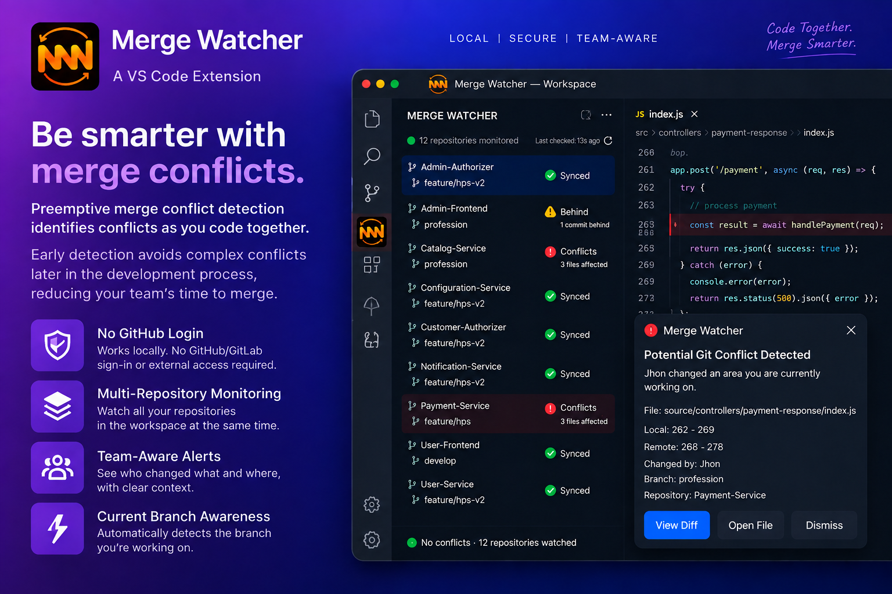

# Merge Watcher



**Automatically detects Git conflicts before pull/merge. No more surprises.**

Merge Watcher monitors your Git repositories in the background and detects potential conflicts between your local changes and remote changes before you run `git pull`.

## Features

* 🔍 **Automatic Git repository detection**
* 🔄 **Background monitoring** of local and remote changes
* ⚠️ **Early conflict detection** before pulling or merging
* 🔔 **Instant notifications** when a potential conflict is detected
* 👀 **View Diff** to quickly understand conflicting changes
* 📂 **Open File** directly from the conflict notification
* 📊 **Live repository status** — Synced, Behind, Conflict, Error, or Stopped
* 📁 **Multi-repository support** for workspaces containing multiple Git repositories
* ⏸️ **Pause and resume monitoring** for individual repositories

## How It Works

Merge Watcher periodically checks your local Git repositories against their corresponding remote branches.

When both your local changes and remote changes affect overlapping lines in the same file, Merge Watcher identifies it as a potential conflict and alerts you before you pull or merge.

## No More Surprise Conflicts

Instead of discovering conflicts after running:

```bash
git pull
```

Merge Watcher gives you an early warning so you can review the changes and resolve potential conflicts before they interrupt your workflow.

## Development

Press `F5` in VS Code to launch an Extension Development Host, then open a folder containing one or more Git repositories with a configured remote.

Run unit tests with:

```bash
npm test
```

Package a `.vsix` for local install/sharing with:

```bash
npx vsce package
code --install-extension mergewatcher-<version>.vsix
cursor --install-extension mergewatcher-<version>.vsix
```
